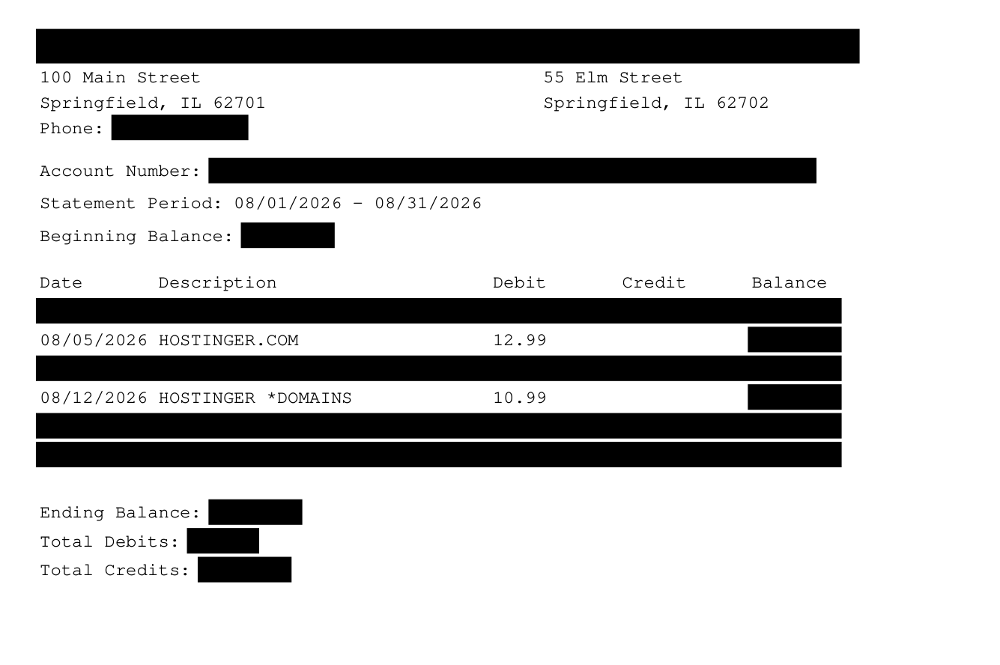
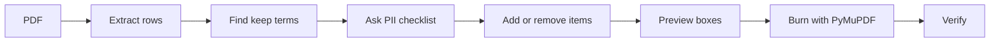

# Redactus

**Keep-search redaction for bank-statement PDFs.** You name what stays visible. Everything else is burned out of the file.

[](LICENSE)
[](https://www.python.org)
[](https://pymupdf.readthedocs.io)
[](#security)

A landlord, auditor, or reimbursement packet does not need your grocery run, your payroll, or your account number. It needs **Hostinger on 03/02 for $4.23**. Redactus finds those rows, keeps date / description / debit or credit, blanks the running balance and every other transaction, then asks which header fields to take with them.

This is **true redaction**. Text is removed from the PDF content stream. A black rectangle painted on top is not redaction. Blur is not redaction. If you can copy-paste it, it is still there.

<p align="center">
  
</p>

*Synthetic layout. Real statements never ship in this repo.*

---

## How it thinks



1. **Keep-search.** `Hostinger` matches `hostinger.com`, `HOSTINGER *DOMAINS`, and USAA `RECURRING DEB CARD PURCH` continuations.
2. **Kept rows** retain date, description, and the debit or credit. Running balance is blank by default.
3. **Every other transaction** is boxed as a whole row, including merchant continuations (`SHEETZ … WAKE FOREST NC`).
4. **Standard fields are a checklist**, not a surprise: account number, routing, bank name/address, holder name/address, phone, email, member number, statement period, beginning/ending balance, period totals.
5. **Add or remove at any time.** Another merchant, one match index, extra text on a kept row (`Larnaka`), or “leave the bank name.” Re-plan is ~0.3s. You are not stuck with the first pass.
6. **Verify fail-closed.** Kept terms must still extract. Distinctive tokens from blanked rows must not.

Engine: **PyMuPDF** (`add_redact_annot` + `apply_redactions`). There is no JEV CLI in this tree. Overlay-only tools are out of scope.

---

## Install

Python 3.12 and a virtualenv. PyMuPDF has wheels; no system PDF toolkit required.

```bash
git clone https://github.com/mrdulasolutions/redactus.git
cd redactus
python3.12 -m venv .venv
source .venv/bin/activate
pip install -r .cursor/skills/bank-statement-redact/scripts/requirements.txt
```

Cursor users: the Agent skill lives at `.cursor/skills/bank-statement-redact/`. Open this repo in Cursor and ask to redact a statement. The skill drives the same CLI.

---

## Quick start

```bash
PY=.venv/bin/python
SCRIPT=.cursor/skills/bank-statement-redact/scripts/redact_statement.py

# See what would stay
$PY $SCRIPT extract statement.pdf -o /tmp/extract.json
$PY $SCRIPT find /tmp/extract.json --keep Hostinger

# Burn a copy. Original is never overwritten.
$PY $SCRIPT redact statement.pdf \
  --keep Hostinger \
  --redact-pii account_number,routing_number,running_balance,beginning_balance,ending_balance,period_totals,phone \
  -o statement_hostinger.pdf \
  --workdir /tmp/redactus
```

`find` prints **indexes**. Use those when you want one hit gone and the rest kept.

```
  [72] p6  03/02  RECURRING DEB CARD PURCH … hostinger.com Larnaka  $4.23
  [79] p6  03/02  RECURRING DEB CARD PURCH … hostinger.com Larnaka  $16.36
```

---

## Revise without starting over

Extract once. Re-plan as the list changes.

| You want | Flag |
| --- | --- |
| Also keep Apple | `--keep Hostinger --keep Apple` |
| Blank one match | `--unkeep-index 79` |
| Extra blank on kept rows | `--also-redact Larnaka` |
| Leave bank name visible | omit `bank_name` from `--redact-pii` |
| Blank the statement period too | add `statement_period` to `--redact-pii` |
| Keep running balance | `--keep-running-balance` |

```bash
$PY $SCRIPT plan /tmp/extract.json \
  --keep Hostinger --keep Apple \
  --unkeep-index 79 \
  --also-redact Larnaka \
  --redact-pii account_number,routing_number,running_balance,beginning_balance,ending_balance,period_totals \
  -o /tmp/plan.json

$PY $SCRIPT preview statement.pdf /tmp/plan.json -o /tmp/preview
$PY $SCRIPT apply statement.pdf /tmp/plan.json -o statement_hostinger.pdf --engine pymupdf
$PY $SCRIPT verify statement_hostinger.pdf /tmp/plan.json
```

---

## What it asks to blank

Recommended **yes** unless you have a reason: account number, routing, phone, email, SSN/ITIN, running balance, beginning balance, ending balance, period totals. Totals leak the hidden activity. A $12.99 Hostinger debit next to an ending balance of $7,225.45 is a tell.

Asked with no default yes: bank name, bank address, account holder name, account holder address, statement period.

Full field ids: [`.cursor/skills/bank-statement-redact/pii-fields.md`](.cursor/skills/bank-statement-redact/pii-fields.md).

---

## Speed

Timed on a 14-page USAA Classic Checking PDF (~177 transactions, 7 keep hits), local SSD, Python 3.12:

| Step | Wall time |
| --- | --- |
| extract | 0.2–0.4 s |
| find | ~0.1 s |
| plan | ~0.1 s |
| apply (PyMuPDF burn) | ~0.2 s |
| verify | ~0.1 s |
| one-shot `redact` | **0.3–0.7 s** |
| revise (plan + apply, no re-extract) | **~0.3 s** |

Nothing is uploaded. The statement never leaves the machine.

---

## Layouts it already survived

USAA Classic Checking splits one visual row across PDF text objects: the Debits/Credits `0` sits ~1.5 pt above the date line, dates are `MM/DD`, and `hostinger.com Larnaka` is a continuation under `DEBIT CARD PURCHASE`. Redactus clusters by Y-midpoint so that still parses as one transaction.

Chase / BofA-style single-line tables with `Date Description Debit Credit Balance` headers work on the same path. Image-only scans are refused until OCR exists; fail closed beats a silent miss.

A synthetic statement is built in:

```bash
$PY $SCRIPT sample -o /tmp/sample.pdf
$PY $SCRIPT redact /tmp/sample.pdf --keep Hostinger \
  --redact-pii account_number,routing_number,running_balance,beginning_balance,ending_balance,period_totals \
  -o /tmp/sample_redacted.pdf --workdir /tmp/sample-work
```

---

## Security

- Original PDF is never overwritten. Output is always a copy.
- Metadata is stripped on burn.
- The CLI prints last-4 masks, not full account or routing numbers.
- Do not paste live statements, full account numbers, or non-kept merchants into chat logs.
- `verify` is the contract: if it exits non-zero, do not deliver the file.

This is a local tool for documents **you own**. It is not legal advice and it is not a substitute for a records-retention policy.

---

## Repository layout

```
.cursor/skills/bank-statement-redact/
  SKILL.md                 # Cursor Agent playbook
  pii-fields.md            # Checklist copy and field ids
  scripts/
    redact_statement.py    # extract / find / plan / apply / verify / redact
    requirements.txt       # pymupdf>=1.24
LICENSE                    # MIT
```

---

## License

[MIT](LICENSE). Copyright (c) 2026 M.R. Dula.
